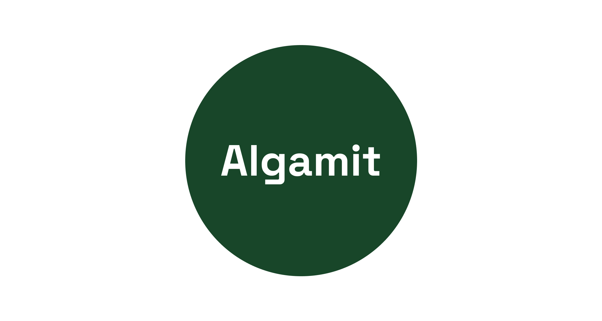

# Algamit - Modern Banking API




Algamit is a project that implements a modern banking API using two different architectural approaches:
1. Apollo Federation (GraphQL)
2. REST Microservices

This project serves as a practical comparison between these two popular architectural patterns in the context of a banking system.

## Docs

### [https://docs.algamit.com](https://docs.algamit.com)
**NB:** The above documentation are for REST only and may contain unstable breaking changes .

## Project Structure

I'll help format the project structure in a cleaner, more readable way:


```
algamit/
├── graphql/                 # Apollo Federation implementation
│   ├── gateway/             # Apollo Router setup
│   ├── accounts/            # Accounts subgraph
│   ├── transactions/        # Transactions subgraph
│   └── README.md            # GraphQL implementation details
│
├── rest/                    # REST implementation
│   ├── gateway/             # API Gateway
│   ├── accounts/            # Accounts service
│   ├── transactions/        # Transactions service
│   └── README.md            # REST implementation details
│
└── assets/                  # Shared assets
    └── images/              # Project images and logos
```


## Core Features

Both implementations provide the same core banking features:
- Account management (creation, updates, balance checks)
- Transaction processing (deposits, withdrawals)

## Choose Your Implementation

### Apollo Federation (GraphQL)
- **[GraphQL Implementation](./graphql/README.md)**
- Features federated GraphQL architecture
- Uses Apollo Router as gateway
- Provides a unified GraphQL schema
- Better for complex, nested queries

### REST Microservices
- **[REST Implementation](./rest/README.md)**
- Traditional microservices architecture
- Uses Express Gateway
- Standard REST endpoints
- Familiar HTTP methods and status codes

## Common Technical Stack

Both implementations share:
- Node.js runtime
- PostgreSQL database
- TypeScript
- Docker support
- Google Cloud Platform ready

## Prerequisites

- Node.js (>=14.0.0 <=20)
- npm or yarn
- Docker (optional)
- Google Cloud Platform account (optional)
- PostgreSQL

## Getting Started

Choose your preferred implementation:

1. For GraphQL Federation:
```bash
cd graphql
# Follow instructions in graphql/README.md
```

2. For REST Microservices:
```bash
cd rest
# Follow instructions in rest/README.md
```

## Security Considerations

Both implementations follow security best practices:
- Environment-based configuration
- API authentication and authorization
- Input validation
- Transaction integrity
- Rate limiting

## Contributing

Contributions are welcome! Please read our [Contributing Guide](CONTRIBUTING.md) for details on our code of conduct and the process for submitting pull requests.

## Resources

### GraphQL Resources
- [Apollo Federation Documentation](https://www.apollographql.com/docs/federation/)
- [Apollo Router Documentation](https://www.apollographql.com/docs/router/)

### REST Resources
- [Express.js Documentation](https://expressjs.com/)
- [REST API Best Practices](https://restfulapi.net/)

### Common Resources
- [Google Cloud Documentation](https://cloud.google.com/docs)
- [PostgreSQL Documentation](https://www.postgresql.org/docs/)

## License

This project is licensed under the MIT License - see the [LICENSE](LICENSE) file for details.